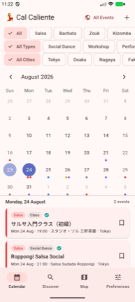
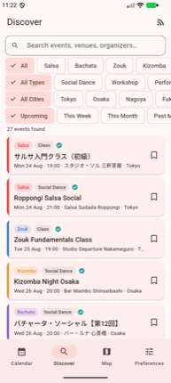
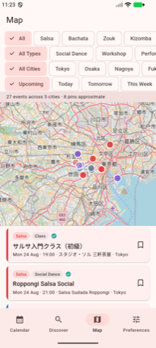

# Cal Caliente

[](https://github.com/Miles-and-miles-away/cal-caliente/actions/workflows/ci.yml)

Salsa & Bachata event calendar for Japan. Flutter + Firebase: Riverpod 3
(codegen), go_router, emulator-first Firebase, Cloud Functions for scraping.

Events are not hand-entered. A daily Cloud Function pulls RSS and iCal feeds
directly, and runs HTML listing pages through Gemini Flash to extract
structured events, deduplicating across sources on two independent keys.

There is no API layer by design: the clients read Firestore through the SDK and
`firestore.rules` *is* the authorization boundary. `SCHEMA.md` is the contract
that rules, functions, app, and seed script are all kept in sync against.

**Status:** development runs against the local emulator suite under project id
`demo-cal-caliente`. A real `cal-caliente` Firebase project is configured in
`lib/firebase_options.dart`, but nothing is deployed to it yet. Everyone starts
as an anonymous Firebase user; Google sign-in upgrades that account in place
(`linkWithProvider`, so favorites and RSVPs carry over). Apple sign-in is still
to come.

## Screenshots

Running against the local emulator suite. The data is the synthetic
fixture set from `make seed-demo`: every event and description is
invented (some placed at real venues, some at invented ones), so no
real listing text appears here.

| Calendar | Discover | Map | Event detail |
|---|---|---|---|
|  |  |  |  |

Month grid with a dot per event coloured by dance style; full-text search across
titles, venues, and organizers behind four filter axes; OpenStreetMap pins with
a count of how many are city-approximate rather than geocoded; and a detail view
with RSVP counts and a deep link out to the venue on a map. Mixed
Japanese/latin text throughout, which the dedup keys in `functions/src/keys.ts`
normalize with Unicode property classes rather than ASCII assumptions.

## English and Japanese

Event listings arrive in both languages, because the sources do: Japanese venue
schedules and English-language Meetup groups feed the same calendar. Content is
bilingual; the UI is English for now, with more languages to come.

| Japanese listing | English listing |
|---|---|
|  |  |

Mixed scripts are a data problem before they are a display problem. Two sources
describing one event rarely agree on punctuation, so the dedup keys in
`functions/src/keys.ts` normalize with Unicode property classes rather than
ASCII assumptions, collapsing every non-letter, non-number run to a single
space:

```
"バチャータ・ソーシャル【第12回】"  ->  "バチャータ ソーシャル 第12回"
"サルサ入門クラス（初級）"          ->  "サルサ入門クラス 初級"
"Tokyo　Salsa　Night"  (U+3000)     ->  "tokyo salsa night"
"(JAPAN) Tokyo Salsa Night 2026"    ->  "tokyo salsa night"
```

Ideographic brackets, the katakana middle dot, full-width spaces, bracketed
prefixes, and year suffixes all fold away, so the same event reported by a
Japanese blog and an English Meetup page collapses to one document. Titles are
keyed at day precision (multi-day festivals must still match) and venues at
hour precision (the 7pm class is not the 9pm social).

Known gap: `normalize("NFC")` preserves full-width Latin, so `ＴＯＫＹＯ` and
`TOKYO` produce different keys. `NFKC` would fold them, but `canonicalKey` is
the Firestore document id, so changing it is a migration rather than an edit.

Locale plumbing is provisioned for `en`/`ja`/`es` (`lib/app/app.dart`), which
today localizes framework widgets and date semantics. App strings are still
English-only; ARB-based localization is the follow-up.

## Worth a look

If you are reading this as a code sample, these three files carry the most
interesting work:

- [`functions/src/safeFetch.ts`](functions/src/safeFetch.ts): SSRF-guarded
  fetch: redirects are followed manually so every hop is revalidated, private
  and link-local ranges are blocked for both IPv4 and IPv6 (including
  IPv4-mapped forms), and the residual DNS-rebinding window is documented
  rather than hidden.
- [`firestore.rules`](firestore.rules): the authorization layer, with
  field-level allowlists and 53 tests against the emulator.
- [`functions/src/keys.ts`](functions/src/keys.ts): cross-source dedup. Two
  key axes at deliberately different time precisions, Unicode-aware title and
  venue normalization for mixed English/Japanese sources.

## Dev loop

Needs the Flutter SDK, Node 22, and a JDK (the Firestore emulator is a JVM
process; set `JAVA_HOME` if `java` is not already on your path).

```bash
flutter pub get && npm ci        # once
cd functions && npm ci && cd ..  # once

make emulators   # auth + firestore + functions + UI on :4000
make seed        # 14 default sources (no events; the scraper is the source)
make run-ios     # or run-android
```

Events come from the real scraper. In the app: Preferences, the swap button
(debug admin sign-in), then Admin, then **Scrape now**. RSS and iCal sources
fetch live feeds; HTML sources need `GEMINI_API_KEY` in the functions
environment or they skip.

To use the admin panel, seed an admin account and pass the same password to the
app (`make run-ios` and `make itest` forward it):

```bash
SEED_ADMIN_PASSWORD=<pick-one> make seed
SEED_ADMIN_PASSWORD=<same-one> make run-ios
```

`make seed-demo` adds hand-written demo events, which exist as fixtures for the
integration tests only; `make purge-demo` removes them.

## Tests

```bash
make test                       # Dart unit tests
make test-rules                 # 53 Firestore rules tests (jest + rules-unit-testing)
cd functions && npm test        # 65 functions unit tests
make itest DEVICE=<device-id>   # end-to-end smoke (run `make seed-demo` first)
```

CI runs the first three on every push to `main` and on every pull request. The integration smoke test needs a
booted device plus a seeded emulator suite, so it stays local.

## Layout

- `lib/features/{events,map,admin,preferences,sources,submit}`: feature-first
- `functions/`: callables (`submitEvent`, `registerSource`, `scrapeNow`,
  `adminDeleteUser`) plus the daily `scrapeSources` job
- `firestore.rules` / `SCHEMA.md`: the authorization layer is the API layer
- `scripts/seed/seed_emulator.js`: idempotent emulator seeding

## History

This repo starts as a React Native + Expo app with an Express/tRPC backend on
MySQL. That version runs through commit `6244276`. Commit `603880b` rebuilds it
on Flutter + Firebase, trading the hand-rolled API layer for security rules and
direct SDK reads. The original data model survives in `SCHEMA.md`, and the
dedup keys in `functions/src/keys.ts` are ported verbatim from the old server so
existing document IDs stay stable.
